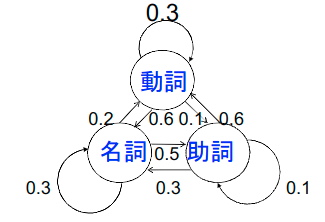
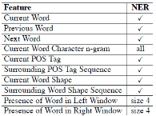

# 自然言語解析基礎01回(導入)

## 授業概要

### 位置づけ

- 人間の言葉を理解する用にコンピュータに言葉を理解させる

### 内容

- 形態素解析・言語モデル・形式文法・構文解析の仕組み
- 意味解析・機械学習・応用事例と基礎技術との関係理解

### 参考書

- Speech and Language Processing

### 評価

- 通常課題+最終レポート
- 未提出回数4回で不可

### 教員

- 関洋平
- 専門
  - 情報アクセス, NLP
  - スマートソーシャルシティ

## 導入

### 自然言語

- 自然言語とは。。。
  - 人工言語との対比
  - 日本語や英語、ドイツ語、中国語

- 自然言語処理
  - 計算機科学、人工知能、言語学
  - 機械翻訳や対話システムの実現に応用
  - 計算言語学は近い分野

## 自然言語処理のタスクとは

- コンピュータに。。。
  - 人間の作成したテキストの意味を解釈
  - 人間ライクなテキストを自動生成
  - しかし困難性をはらむ(AI完全)

## なぜNLPは注目されるか

- ソーシャルメディアのNLPデータ処理
- 対話プログラムの重要性の増加
- ディープラーニング*事前学習の有効性
  - 前処理をNLPで行う(アノテーション)

## 本題

### 形態素

- 言葉を計算機に理解させる
- 単語の判別
  - `mecab -Owakati <<<すもももももももものうち`

- 意味の判別
  - 「`(?:シャツ|スイッチ|花)のボタン`」

- 照応関係の解析
  - **その人**のかいた小説は…(その人は誰？)
  - **泳げない**(誰が主体？)

- 含意関係の理解
  - 仮説: トランプはヒラリーに敗北した
  - テキスト: トランプは2016年の選挙で候補者ヒラリーを破り当選した。

## 課題

### 曖昧性の解消

- 表記の曖昧性
  - 「もも」「モモ」「桃」
  - 「ローラー」「ローラ」

- 単語区切りの曖昧性
  - 「すもももももももものうち」
  - 「愛されたのですが、愛したくない」
  - どこで区切るか

- 品詞の曖昧性
  - 「卓球の愛ちゃん」「大いなる愛」
  - 名詞？動詞？人名？

- 語義の曖昧性
  - 「サーブ」
    - サーブを洗車した(車種)
    - 彼のサーブは強烈だ(スポーツ)
  - 「明るい」
    - 電気？性格？

- 構文の曖昧性
  - 「夫と一緒に犬をベッドに寝かせた」
    - 「夫と犬を寝かせた」or「夫と私で犬を寝かせた」

- 文の意味の曖昧性
  - 「もはや俺に勝てる相手などいない」
    - 俺にとって勝つことのできる人
    - 俺を負かすことのできる人

## アルゴリズム

- 有限状態機械(オートマトン)
  - 人名、製品名(固有名詞)の認識
  - 形態素解析を行う
  - 品詞を状態とするマルコフモデル
    - 名詞の後に助詞が来る確率
    - 名詞の後に動詞が来る確率

  - 条件付き確率場(CRF)
  - 状態の探索: DP, DFS(A*探索)
  - 状態の学習: 期待値最大化法(EMアルゴリズム)

- 品詞を状態とした遷移確率に基づくオートマトン



- 文脈自由文法: 構文解析に用いられる

  - 構文解析木

```lisp
(文
  (主語
    (名詞句(名詞 -> "名前"))
    (係助詞 -> "は"))
  (述語
    (名詞 -> "太郎")
    (助動詞 -> "です")))
```

- 機械学習によるクラス分類
  - 入力: 人間作成の「訓練データ」
  - 出力: 未処理「テストデータ」の分類
  - テキスト分類、評判情報抽出に応用
  - SVM，決定木，ガウス混合モデル, LSTM, BERT

## 歴史

### 1940~50s: 基礎

- シャノン: オートマトン、コード化
- チョムスキー: 形式言語0, 文脈自由文法

### 1957~70: 記号論, 確率論の対立

1956: 人工知能概念の提唱

### 1970~1983: 記号処理の発展

- 論理モデル
  - Prologでの実装, DCG, 単一化

- 自然言語理解
  - Winograd: SHRDLU
  - Schank: スクリプト
  - Fillmore: 格フレーム

- 談話焦点, 対話モデル
  - BDI, 信念・欲求・意図

### 1983~1999: 確率論への回帰と発展

- コンピュータの発達
- 有限状態オートマトンによる形態素解析
  - space-sepの英語ならでは
  - juman-dicによる日本語形態素解析

- 経験主義的アプローチによる品詞タグ付け
- 言語データを利用した確率アプローチの発展

### 2000~now: 機械学習から実用タスクへ

- 大規模コーパスの利用した教師有り学習
- 近年は「教師なし学習，半教師あり学習」で楽しよう
- 深層学習=事前学習+ファインチューニング(BERTなど)
  - 2018年より提唱
- 人が行う言語理解の水準へ

## 機械学習と自然言語処理

### データから分類規則などを学ぶ枠組: コーパス

- 自然言語処理では，データとしてコーパスを用いる
  - コーパス: 言語学において、自然言語処理の研究に用いるため、自然言語の文章を構造化し大規模に集積したもの。
    - 構造化し、言語的な情報を付与している。
- コーパスから統計情報（特徴素，素性，手がかり）を取りだし，数学の世界に持ち込んで，何らかの処理を行う

### 学習

- データから分類のためのモデルや規則を導くこと
  - 訓練データ：学習に用いられるデータ
  - 検証データ：パラメータ調整に用いられるデータ
  - テストデータ：評価に用いられるデータ

### 機械学習の2つの側面

- 入力表現や素性（手がかり）を人手で
  - 工夫例：固有表現の抽出の手がかり



- 予測を最良とする重みの最適化
  - アルゴリズムの改良

### 人間の言語の特徴

- 離散的な記号を利用してカテゴリを表現するシステム


- 言語：記号によるカテゴリ表現システム
- 脳：活性化された信号の連続パターン
- 記号は連続値（音やジェスチャーや画像など）のパターンにより伝達
- 記号による単語のコード化
  - 情報量が少ないスパース（疎）な性質→機械学習の問題
- 思考のパターンを連続値でコード化するには？

### 深層学習: 機械学習アルゴリズムの一種

- コンピュータ自身に表現の素性判別->表現学習
  - 良い素性や入力表現を自動的に獲得
  - 手作業より高速
  - 生のテキストからの教師なし学習，ラベル付きデータからの教師あり学習に利用できる34

- 深層学習
  - 生の入力データ（音声，ピクセル，文字，単語）から（複数のレベルの）表現と出力を学習

### 深層学習の歴史

- ニューラルネットワークの一種
- 多層化されたロジスティック回帰(=ディープラーニング)→ニューロンの興味深いモデル化
- 2010年以降，他の機械学習アルゴリズムを上回る精度を達成(データ処理コンペで注目)
  - ディープラーニングに適した大量のデータ
  - マルチコアCPU/GPUを備えた計算機
    - 並列にデータを高速処理可能になったことが発展に拍車
  - 文脈，タスク転移学習の開発
  - さまざまな正則化や学習率最適化手法の開発
  - 音声認識（2010年），CV（2012年）などの分野で有効性が証明される

### 深層学習と自然言語処理（Deep NLP）

- 自然言語の解釈には様々な知識が必要
- 表現学習を機械学習に任せたい->ディープラーニングの表現学習で
- 自然言語処理で使用される表現学習の手法
  - 例: LSTM, GRU, CNN, Attention, BERT, RoBERTa

- 大量のテキストデータから教師なし事前学習+ファインチューニングでスパースの補完できて精度向上
  - ファインチューニング: 少量のラベル付きデータで調整する

### 自然言語処理の研究の潮流(日進月歩)

- 新たな事前学習モデルの開発
  - BERT
  - Deep Contextualized Word Representations
  - Improving Language Understanding by Generative Pre-Training

- 注意機構（Attention）による適切な重みづけ
  - Sequence Classification with Human Attention
    - 視線追跡情報のコーパスを利用
  - Linguistically-Informed Self-Attention for Semantic Role Labeling
    - 構文情報を利用

### 事前学習モデル：BERTとは

- Transformer（Attention を利用したエンコーダ）を利用して単語予測をモデル化し，事前学習
  - Attention（注意機構）
    - 入力となる単語の隠れ状態と，出力の隠れ状態との直積を計算し，入力の単語のうち，どの単語が出力に影響するか区別する機構

- 事前学習タスクを開発: マスク付き言語モデルにより前後の文脈を考慮して予測する（双方性）
  - 入力: `The man want to the [MASK1]. He bought a [MASK2] of milk.`
  - 予測ラベル: `[MASK1] = store`; `[MASK2] = gallon`

- 事前学習したモデルを，質問応答タスク，固有表現抽出タスク等に調整し，高い精度で解決

## 自然言語処理ツール for ja_JP

- 形態素解析
  - [MeCab](http://taku910.github.io/mecab/)
  - [JUMAN++](http://nlp.ist.i.kyoto-u.ac.jp/index.php?JUMAN++)
  - [KyTea](http://www.phontron.com/kytea/index-ja.html)
  - [SentencePiece](https://github.com/google/sentencepiece)
- 構文解析
  - [CaboCha](https://taku910.github.io/cabocha/)
  - [KNP](http://nlp.ist.i.kyoto-u.ac.jp/index.php?KNP)
- シソーラス
  - [日本語WordNet](http://compling.hss.ntu.edu.sg/wnja/)

