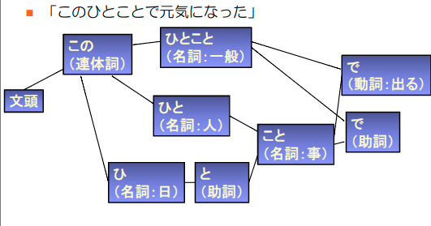
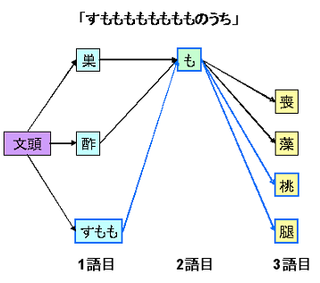
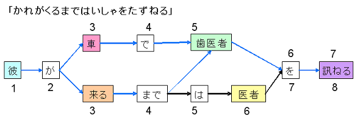
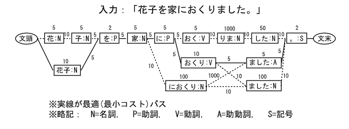
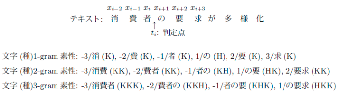
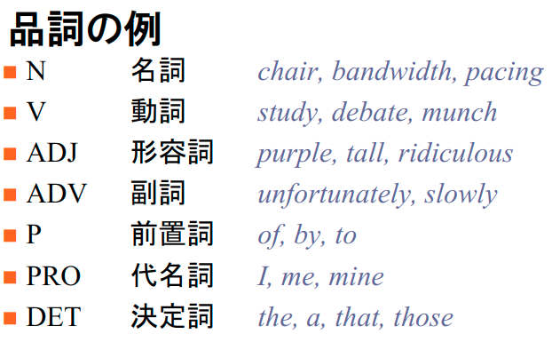
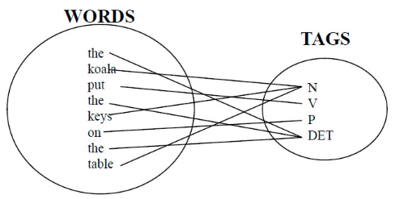
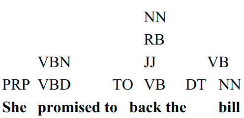
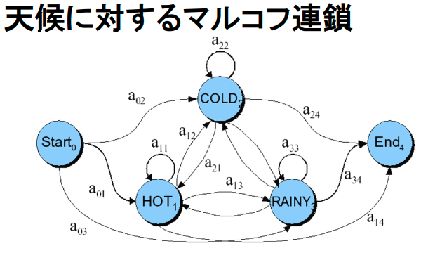
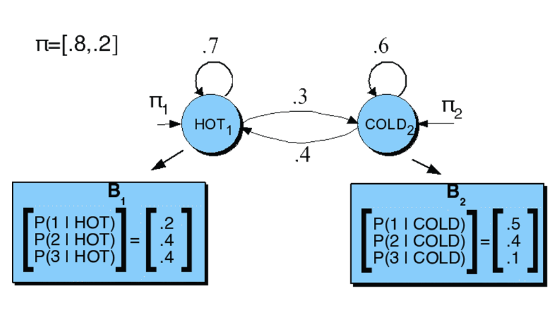

# 自然言語解析基礎01回(形態素解析) (10/12)

## 形態素解析の意味

### 形態素解析 is 何？笑

- 形態素解析（`morpheme analysis`）
  - 意味を持つ最小の言語単位を判別する
  - 形態素の定義やその難しさは言語ごとに異なる
    - ex1) 日本語の形態素解析
      - 単語を区切る空白が存在しない
        - hard
      - 形態素列への分割と同時に品詞を割り振る
        - hard
    - ex2) 英語の形態素解析
      - 語基(do, fuzz)と接辞(-es, -ed, -y, -tion)に分類⇒各形態素の数，性，時制，人称，格などを決定
        - easy
      - 各単語の品詞を判別（名詞と動詞など品詞の曖昧性が高い）
        - hard

### 用語

- 形態素(`morpheme`)
  - 意味を持つ最小の言語単位
- 自然言語の階層構造
  - 音素（`phoneme`）
    - 人間の意味伝達において，音声をどのように使っているか反映した音の単位．
  - 形態素
    - 単語（`word`）
      - 一つ以上の意味のまとまりをなし，文法上ひとつの機能を持つ最小の言語単位．
  - 文（`sentence`）
    - あるまとまった内容を持ち，形の上で（句点やピリオドで）完結した言語単位．
  - 文章・テキスト
    - あるまとまった内容を表現するために，文を順序付けた集合

## 日本語の形態素解析

### 古典的な方法

- 初期のJumanなどでの手法
  - 単語辞書と2単語間の連接可能性辞書を準備
    - 単語辞書=単語の品詞，読み，活用形
    - 連接可能性辞書=連接可能な2単語のタイプを指定

- 辞書を参照して入力文中の各位置から始まる単語を取り出す

- 単語辞書のデータ構造例

  | 見出し語 | 読み   | 品詞      | 活用形    |
  | ---- | ---- | ------- | ------ |
  | 日本語  | にほんご | 名詞：普通名詞 |        |
  | 英語   | えいご  | 名詞：普通名詞 |        |
  | 読む   | よむ   | 動詞      | 子音動詞マ行 |
  | 書く   | かく   | 動詞      | 子音動詞カ行 |

- 連接可能辞書のデータ構造例

  | 左側                | 右側                         |
  | ----------------- | -------------------------- |
  | 文頭                | 名詞，動詞，形容詞，形容動詞，副詞，連体詞，...  |
  | 名詞，動詞 連用形         | 助詞：格助詞，副助詞，引用助詞，名詞接続助詞，... |
  | 動詞 基本形            | 助詞：終助詞 ぞ，ぜ，わ               |
  | 動詞 意思系            | 助詞：終助詞 ぜ                   |
  | 動詞 基本形            | 助詞：述語接続助詞，し，が，とも，から...     |
  | ...               | ...                        |
  | 基本形，命令形，名詞，助詞：終助詞 | 文末                         |

- 解析結果例（ラティス構造）
  - 単語の候補を列挙したグラフ構造
  - 形態素解析する文章の表記に部分一致する全ての単語を辞書から抜き出し
  - 単語の候補を列挙した「単語ラティス」を作成

## 最尤の形態素列を選択するための提案

形態素解析の結果候補の中から正しそうなものを順位付けするアルゴリズム

### 1. 最長一致法(longest match method)

- 古典
- 文頭から，長い形態素（単語）を優先して縦型探索で解を抽出

### 2. 文節数最小法

- 文節数の少ない解を優先

### 3. コスト最小法

- 現在の主流
- 単語と単語の連接にコストを与えて，総コストの少ない解を優先
  - 「ある品詞のあとによく後続する品詞に高コスト」
  - 「ある名詞のあとによく後続する接続詞」

### 日本語形態素解析の問題点

- 1. 複合語の登録
  - コスト計算を低く抑えるために，複合語を登録
- 2. 未知語の処理
  - 辞書に登録されていない文字列
  - 連続する漢字，カタカナ，記号列などを名詞とする
- 1, 2 は新規な単語をどう扱うか/獲得するかという問題
- 3. コストの自動付与
  - コストを人手で与える手間が大きい
    - ていねいにやれば自動選別よりは精度がマシ
  - コーパス（品詞が付いた例文集）からの自動学習
    - 隠れマルコフモデル(Hidden Markov Model)
      - 茶筅で採用
    - 条件付き確率場（Conditional Random Fields）
      - MeCabで採用

### 日本語形態素解析器の実装例

- KyTea
  - 点推定（point estimation）に基づく形態素解析
    - 観測データに基づいて未知量に対する最尤な推定量の統計量を計算する手法と結果
    - 平均値・中央値・最頻値など
  - 点推定による単語分割/品詞推定
  - メリット
    - 未知語の概念が存在しない
    - ドメイン（新聞記事，Yahoo!知恵袋，レシピ等）に適応した形態素解析の実現に向いている

- [mecab-ipadic-NEologd](https://github.com/neologd/mecab-ipadic-neologd/wiki/Home.ja)
  - 2015年3月公開
  - [IPADIC](http://taku910.github.io/mecab/#download)を拡張したmecabのシステム形態素辞書
  - 新語168万語を再録/最低月2回アップデート
  - Webクロールによる資源，人力資源を参照してエントリを作成
  - IPADICで分かたれてしまう固有表現を積極的に採用
- [JUMAN++](http://nlp.ist.i.kyoto-u.ac.jp/index.php?JUMAN++)
  - 再帰型ニューラルネットワーク言語モデル(RNN)に基づく形態素解析
  - 2016年9月公開
  - 2.3万語程度の辞書を人手で整備
  - Wikipediaやウェブコーパスから自動獲得
  - RNNでそれ以前に出現した単語から次の単語が出現する確率を予測
  - MeCab（without Neologd）より高精度
  - 速度がかなり遅い
- [SentencePiece](https://github.com/google/sentencepiece)

  - ニューラル機械翻訳向けトークナイザ
  - 2017年4月公開
  - RNNにおけるテキスト生成では大規模な語彙を扱えない
  - サブワードという概念を用いて，低頻度語を文字や部分文字列に分割

    - テキストを単語分割し各単語の頻度を前計算し、
      - 高頻度の単語は1単語
      - 低頻度語はより短い単位に分割

    - トークン数が指定のサイズ(1k~100k)以下になるまで分割

    - 実質未知語がなくなる

### 日本語の形態素解析まとめ(英語との比較)

- 基本は同じ
- Chasen, MeCabは最小コスト計算法のコストをコーパスから機械学習
- 品詞の系列の遷移確率の代わりに，形態素の連接確率を計算
- ある品詞に対する単語の出現確率の代わりに，形態素の出現確率を計算
- 茶筅：隠れマルコフモデルを使う
- MeCab：条件付き確率場（CRF）を使う
- JUMAN++: 人手で整備した辞書＋再帰型ニューラルネットワーク言語モデルを使う

## 英語の形態素解析

### 英語の形態論

- 形態論is何？
  - 形態素から，どのように単語が構築されるかを研究
  - 形態素（cats）を2つのクラスに分割
    - 語幹（cat）: 核となる意味単位
    - 接辞（s）: 語幹に対する文法機能（複数形）

- 英語の形態素解析タスク
  - 単語がスペースで区切られており，日本語と異なる
  - 語幹と文法機能を判別->単語の品詞を判別（品詞タグ付け）

- 英語の名詞と動詞の形態論
  - 名詞は語幹/接辞(複数形，所有格など)が単純(人々，場所，事物など)
  - 動詞は少し複雑(動作，過程，状態など)
    - 動詞の時制によって変化，不規則動詞の存在

### 英語の品詞(POS, parts of speech)

- 名詞，動詞，形容詞，前置詞，副詞，補助動詞，決定詞（冠詞），間投詞，代名詞，接続詞など...

- _(日本語では，形容詞->イ形とナ形に区別, 助詞，助動詞, 連体詞, 決定詞，間投詞, 感動詞が対応)_

### 品詞タグ付け

- 品詞のタグ付け（POS Tagging）
  - テキスト集合に出現する単語に対して，品詞を**自動的に**付与する処理
  - 文脈によって品詞を決定する必要（単語の例：back）
    - The back/JJ（形容詞） door
    - On my back/NN（名詞）
    - Win the voters back/RB（副詞）
    - Promised to back/VB（動詞）the bill
  - 実用的なタスクへの応用が効く
    - 構文解析
      - 単語が名詞か動詞か等，事前に判別する必要があるため
      - 情報抽出
        - 人名，組織名，関係の発見のため(固有名詞？一般名詞？)
      - 機械翻訳
        - 他言語の対応語彙への変換のために品詞情報が形態素ごとに必要

### 品詞の閉じた/開いたクラス

- 閉じたクラス=少数の固定した要素(基本的に不変)
  - 通常，機能語（文法的役割を果たす短い単語）
  - 前置詞: on, under, over, of, in, by, ...
  - 補助動詞: should, may, can, will had, been, ...
  - 代名詞: I, you, she, mine, his, them, ...
  - 冠詞: up, down, on, off, ...
  - 決定詞: a, an, the, ...
  - 接続詞: and, but, or, ...
  - 数詞: one, two, three, third, ...

- 開いたクラス=新語がいつでも追加される可能性
  - 英語では名詞，動詞，形容詞，副詞の4つ
  - 名詞
    - 固有名詞(Boulder, Granby, Eli Manning)
      - 英語では大文字で始まる
    - 普通名詞（上記以外）
      - 複数形と集合名詞
        - 集合名詞では複数形を取らない(snow, salt, communism) (\*two snows)
    - 形容詞
      - 事物を修飾する
      - 方向・位置の副詞(here, home, downhill)
      - 程度の副詞(extremely, very, somewhat)
      - 方法の副詞(slowly, slinkily, delicately)
    - 動詞
      - 接辞による形態変化がある(eat-eats-eaten)

### 品詞タグ集合(POS tagset)

- 基本的なタグ集合
  - N（名詞）, V（動詞）,Adj（形容詞）, Adv（副詞）
    - [English Penn TreeBank tagset](https://www.sketchengine.eu/tagsets/penn-treebank-tagset/)では，45のタグ
    - ツリーバンク=構文構造を注釈としてつけた例文集
  - 品詞タグの下位分類
    - eats/V ⇒eat/VB, eat/VBP, eats/VBZ, ate/VBD, eaten/VBN, eating/VBG, ...
    - 形態変化，構文機能を反映している

### List of English Penn TreeBank tagset

| POS Tag | Description                            | Example                                 |
| ------- | -------------------------------------- | --------------------------------------- |
| CC      | coordinating conjunction               | and                                     |
| CD      | cardinal number                        | 1, third                                |
| DT      | determiner                             | the                                     |
| EX      | existential there                      | there is                                |
| FW      | foreign word                           | les                                     |
| IN      | preposition, subordinating conjunction | in, of, like                            |
| IN/that | that as subordinator                   | that                                    |
| JJ      | adjective                              | green                                   |
| JJR     | adjective, comparative                 | greener                                 |
| JJS     | adjective, superlative                 | greenest                                |
| LS      | list marker                            | 1)                                      |
| MD      | modal                                  | could, will                             |
| NN      | noun, singular or mass                 | table                                   |
| NNS     | noun plural                            | tables                                  |
| NNP     | proper noun, singular                  | John                                    |
| NNPS    | proper noun, plural                    | Vikings                                 |
| PDT     | predeterminer                          | both the boys                           |
| POS     | possessive ending                      | friend’s                                |
| PRP     | personal pronoun                       | I, he, it                               |
| PRP$    | possessive pronoun                     | my, his                                 |
| RB      | adverb                                 | however, usually, naturally, here, good |
| RBR     | adverb, comparative                    | better                                  |
| RBS     | adverb, superlative                    | best                                    |
| RP      | particle                               | give up                                 |
| SENT    | Sentence-break punctuation             | . ! ?                                   |
| SYM     | Symbol                                 | / \[ = \*                               |
| TO      | infinitive ‘to’                        | togo                                    |
| UH      | interjection                           | uhhuhhuhh                               |
| VB      | verb be, base form                     | be                                      |
| VBD     | verb be, past tense                    | was, were                               |
| VBG     | verb be, gerund/present participle     | being                                   |
| VBN     | verb be, past participle               | been                                    |
| VBP     | verb be, sing. present, non-3d         | am, are                                 |
| VBZ     | verb be, 3rd person sing. present      | is                                      |
| VH      | verb have, base form                   | have                                    |
| VHD     | verb have, past tense                  | had                                     |
| VHG     | verb have, gerund/present participle   | having                                  |
| VHN     | verb have, past participle             | had                                     |
| VHP     | verb have, sing. present, non-3d       | have                                    |
| VHZ     | verb have, 3rd person sing. present    | has                                     |
| VV      | verb, base form                        | take                                    |
| VVD     | verb, past tense                       | took                                    |
| VVG     | verb, gerund/present participle        | taking                                  |
| VVN     | verb, past participle                  | taken                                   |
| VVP     | verb, sing. present, non-3d            | take                                    |
| VVZ     | verb, 3rd person sing. present         | takes                                   |
| WDT     | wh-determiner                          | which                                   |
| WP      | wh-pronoun                             | who, what                               |
| WP$     | possessive wh-pronoun                  | whose                                   |
| WRB     | wh-abverb                              | where, when                             |
| #       | #                                      | #                                       |
| $       | $                                      | $                                       |
| “       | Quotation marks                        | ‘ “                                     |
| \`\`    | Opening quotation marks                | ‘ “                                     |
| (       | Opening brackets                       | ( {                                     |
| )       | Closing brackets                       | ) }                                     |
| ,       | Comma                                  | ,                                       |
| :       | Punctuation                            | – ; : — …                               |

### 規則に基づくタグ付け

- 1. 辞書から選択した単語に付与できる可能性のあるすべてのタグを付与

- 2. 人手で不適切なタグを除去する規則を書く
  - ex) VBD/VBN（過去形・過去完了）が開始記号/PP(代名詞)に続いたとき，VBN （過去完了）を削除

- 3. それぞれの単語に対して，正確なタグを残す

### 統計に基づくタグ付け(確率連鎖モデルのひとつ) : HMM, 隠れマルコフモデル

- ベイズ推定の応用
  - ベイズの規則: 結果から原因を推定可能
    - `P(B|A)`から`P(A|B)`を求める
    - `P(A|B) = P(A) P(B|A) / P(B)`

- 品詞タグ付けを定式化する
  - ある文の最尤品詞系列を求める
  - その際:
    - すべての起こりうるタグ系列確率を考慮
    - その中から，観察した$n$個の単語$w_1...w_n$が与えられたとき，最も確率の高そうなタグ系列を選択
    - つまり、最も一般的に使われている品詞の繋がり方を選べばよい

- 隠れマルコフモデル（HMM）

  - すべての$n$個のタグ系列$t_1...t_n$から，確率 $ P( t_1...t_n| w_1 ...w_n)$が最も高くなるような唯一のタグ系列を見つける

  - ハット記号 ^  :  推定した中で最良の系列

  - $ argmax_x f(x)$  : $f(x) $ を最大化する$x$

  - $w_1...w_n$を観察して考えうるタグ系列集合の中から確率を最大にできる$t_1...t_n=\hat{t}^n_1$を求めれば良い

$$ \hat{t}^n_{1} = argmax_{t^{n}_{1}} P(t^n_1 | w^n_1) $$

- HHMs
  - HMMを計算可能な，他の確率集合に置き換える(ベイズ規則の適用)
  - $ P(t^n_1 | w^n_1) $を$ P(w^n_1 | t^n_1) $から推定可能にする

$$
\hat{t}^n_1 = argmax_{t^n_1} P(w^n_1 | t^n_1) P(t^n_1) \\
\approx argmax_{t^n_1} \prod^n_{i=0}
 P(w_i | t_i)P(t_i | t_{i-1})
$$

### 2種類の確率

- 品詞タグ遷移確率

$$P(t_i|t_{i-1}) = \frac{C(t_{i-1},t_i)}{C(t_{i-1})} $$
$$ = \frac{品詞t_{i-1}と連接する品詞t_iの単語数}{品詞t_{i-1}の単語数}$$

- 単語尤度（タグらしさ）確率

$$P(w_i|t_{t-1}) = \frac{C(t_i,w_i)}{C(t_i)} $$
$$ = \frac{品詞がt_iであるw_iの単語数}{品詞t_iの単語数}$$

### マルコフ連鎖

- ある状態から別の状態への（1 ステップの）遷移確率が唯一に決まる状態系列
- 各状態を重みつき有限状態オートマトンに乗せる
- 状態A->Bに遷移する確率を全ての状態間に貼る
- ある状態を起点とした、別の状態に遷移する確率の総和は常に1(A: ->B: 0.1, ->C: 0.3, ->D: 0.6)

- $ P(雨→雨→雨→雨) = a_{03} * (a_{33})^3 $

### 隠れマルコフモデル

- 各状態と出力記号とを、それぞれ異なったものとする
  - 出力記号「うんこ」に隠れ状態「臭い, 汚い」をつける
- 入力記号が状態と同一ではないという点で通常のマルコフ連鎖の拡張
- 「隠れ状態の推定」タスク
  - ex) アイスクリームのタスク(食べた個数から天候を推定)
- 「{寒,暑}い時にアイスを{1,2,3}個食べる確率」を隠れ状態として持つオートマトン

## まとめ

- 日本語の形態素解析（コスト最小法）
- 品詞，タグ集合
- 品詞タグ付け
- HMM によるタグ付け
  - マルコフ連鎖
  - 隠れマルコフモデル
