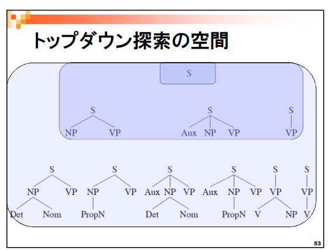
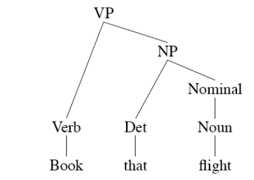
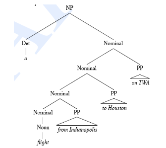

# 自然言語解析基礎04回(形式文法) (10/26)

## 形式文法とは

### 文法(自然言語における)

- 母語話者の言語知識

### 構文

- 文法に依って導出される、単語の組み合わせ/関係
- 形態素列を入力して、構文構造が得られる
- 文・発話の意味解析の入力となる
- 木構造で表現する

### 文法(チョムスキーの提唱する)

- 普遍文法
  - (言語に依存しない文法)
- 普遍的な原理＋言語に依存したパラメタ
  - 孤立言語(中国語)，膠着言語(日本語)，屈折言語(英語)，SOV言語，SVO言語などを決定できる

### 文法の構成要素

- 文に出現する単語のグループは、ある基本単位(品詞の句)として同じように振る舞う
  - ex: 名詞句は動詞の前に出現できる

## 文脈自由文法（Context Free Grammar）

- 句構造文法とも
- BNF記法で表記

### 文脈自由文法の構成要素

- 終端記号
  - 形態素, 単語レベル
- 非終端記号
  - 名詞句, 動詞句, 文, 名詞など
- 文法規則
  - 一つの非終端記号を左辺に置き右辺の複数の終端または非終端記号に変換

### 句構造文法例

- NP -> Det Nominal
  - NP: 名詞句
  - Det: 決定詞
  - Nominal: 複合名詞
- NP -> ProperNoun
  - ProperNoun: 固有名詞
- Nominal -> Noun | Nominal Noun
  - 縦棒はOR

### チョムスキー階層

- 生成規則による言語の生成能力の違い
  - バリエーションが違う
- 4階層
  - (能力大, 寛容)
  - 0型文法
    - 終端. 非終端区別なし
    - a->b(a, bは記号列)
  - 文脈依存文法
    - a->b, |a|<|b|
    - aの方がbより記号数少
  - 文脈自由文法
    - A->b
    - Aは非終端記号1つ
  - 正規文法
    - A->aB
      - A, Bは非終端記号, aは終端記号
    - A->a
      - 右辺には必ず終端記号aを含む
  - (能力小, 厳格)

### 文法規則のメリット

- 文法規則を適用すると
  - ある言語の任意の単語列を生成出来る
  - ある任意の単語列が文法により受理可能か受理できないかを判断できる
  - 構文解析により生成した構文木で単語間の関係を把握できる
- 構文解析(Parsing)とは
  - 単語列, 文法を入力して、構文木を導出/生成する処理
- 名詞句の中心要素を主辞という
- 捉えられない一致（時制・3単現・単数複数形）がある文法規則は過剰生成規則
  - this flightとthose flightを持つNP -> Det Nominal
  - 誤った, 予期しない構文が生成されてしまう

### 下位範疇化

- 品詞などを更に細かく分類
  - 動詞を他動詞/自動詞に分ける

### ツリーバンク

- 各文に構文解析木を付けたコーパス
  - Penn Treebankが有名
    - 動詞句に対して4,500もの文法規則を設定
    - 再帰規則の排除

## 依存構造の文法（Dependency Grammar）

- 文中の2単語間の関係をラベリングしながら構文解析
- 日本語の構文解析器は（ラベルなし）依存構造の構文解析が多い

### 依存構造の構文解析の利点

- 語順の自由な言語をうまく取り扱える
  - 文脈自由文法では規則中の順序の制約が強い
  - (自動)構文解析が早い

## 構成素構造の構文解析（Constituency Parsing）

- 単語列を入力として，文法規則に適合する構文木を導出
- 探索過程で複数の候補となる構文の中から最もそれらしいものを選択する必要
- 品詞のタグ付けも行う

### トップダウン(下降型)探索

- 開始記号Sからスタートし，単語に向けて下降しつつ構文木を形成
- 開始記号と整合性のとれる構文木を形成
- 入力単語列とは整合性のない構文木を探索

### ボトムアップ(上昇型)構文解析

- 入力する単語（形態素）からスタートし，単語同士を結び付けて上昇しながら構文木を形成
- 入力単語列と整合性のとれる構文木を形成
- 開始記号からすると無意味な構文木を探索

### バックトラック（後戻り）

- 構文木の候補の中で、失敗したらステップを選択時まで戻す

## 構文解析の課題

### 曖昧性

- 妥当な構文解析結果が複数考えられる場合
- 結果を一意にするには？

### 解析結果の共有

- 共通構造を持つ文の解析時、以下のようにNominal -> Nominal PPが重複する
  - 結果がその分膨張する(データ格納効率悪)
- 解決法としてCKY法(トップダウン), アーリー法(ボトムアップ)がある

