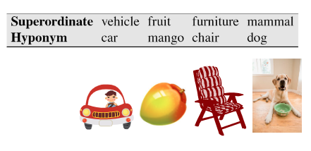
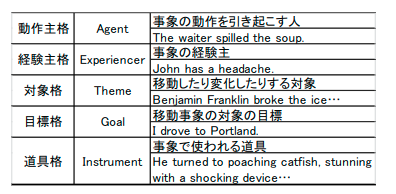
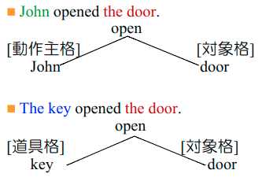

# 自然言語解析基礎06回(構文解析) (11/23)

## 意味解析の概要

- 文字列間の関係は、文の構文構造の他に、文の意味を考える必要がある

### 意味とは

- 単語を並べることによって表される意味
- 単語がもともと持っている意味

### 意味解析

- 構文情報を与えられた文に対して:
  - 意味的に異常な文の排除（意味の通ってない文の削除）
    - ○林檎を食べた。
    - ×意思を食べた。
    - △乾燥剤を食べた。
  - 文中の単語の意味を特定する
    - 著者（Jane Austen wrote Emma.）v.s.作品（I really love Jane Austen.）
    - 動物（The chicken was domesticated in Asia.）v.s. 肉（The chicken was overcooked.）
    - 木（Plums have beautiful blossoms.）v.s.果物（I ate a preserved plum yesterday.）
  - 文中の単語間の意味的関係を同定して、文の意味構造を調べる
    - John opened the door.
    - The key opened the door.
    - The door opened.
    - John opened the door with the key.
  - 表層格（主語・述語・目的語・前置詞）⇔深層格（動作主・対象・道具）の対応付け

## シソーラスを用いた意味類似度計算

### 有名なシソーラス

- WordNet（プリンストン大学）：約15万語
  - <http://wordnetweb.princeton.edu/perl/webwn>
  - 階層的に構成された語彙データベース
    - 上位語/下位語の関係
  - 1つの名詞は平均1.23個の意味を，1つの動詞は平均2.16個の意味を持つ

- 分類語彙表（国立国語研究所）：約9.5万語
- 日本語語彙体系（NTT）：約30万語
- EDR（情報通信研究機構）：約27万語
- 日本語ワードネット（情報通信研究機構）：約9万語

### シソーラスの構造

- 上位語（Superordinate）・下位語（Hyponym）の定義



### 単語の類似度計算（Resnik の方法）

- `P(c=LCS(word1, word2))`
  - `LCS(_1, _2)`=最短共通祖先, least common subster
    - シソーラス中の語彙内で最短で共通の上位存在となる単語のこと
  - `P(c)`=`(cに包含される単語の集合/シソーラス中単語数)`

## シソーラスを用いた意味類似度計算（プログラミング）

- nltk pythonでやってみる

```python
>>> import nltk
>>> nltk.download()
>>> nickel = wn.synset('nickel.n.02')
# 語義の取得
>>> dime = wn.synset('dime.n.01')
>>> money = wn.synset('money.n.01')
>>> nickel.lowest_common_hypernyms(dime) # 最短共通祖先
[Synset('coin.n.01')]
>>> nickel.lowest_common_hypernyms(money)
[Synset('medium_of_exchange.n.01')]
>>> wn.synset('coin.n.01').min_depth() # 最上位概念（entity）からの深さの計算
8 # 深いほど具体的
>>> wn.synset('medium_of_exchange.n.01').min_depth()
5 # 浅ければ一般的
>>> nickel.path_similarity(dime)
0.3333333333333333
>>> nickel.path_similarity(money)
0.1666666666666666
```

## 周囲語の分布を考慮した意味解析

### シソーラスを利用しない単語間の類似度計算

- “fast" は“rapid" に似ている
- “tall" は“height"に似ている
- 質問応答への応用:
  - 質問: “How tall is Mt. Everest?"
  - 回答候補: “The official height of Mount Everest is 29029 feet."
  - tallに呼応する共起表現にheightが考えられる

### 周囲語の分布による意味モデル= ベクトル空間による定式化

- 単語の意味をVSMで表現
- Zellig Harris (1954):
  - “oculist とeye-doctor は，ほぼ同じ周囲語の中に出現"
  - “単語A とB がほぼ同じ周囲語の中に出現するのであれば，同義語と見なす"
- Firth (1957):
  - “You shall know a word by the company it keeps!"
  - （単語の意味はその周囲の言葉により理解できる）
- 単語-文書行列を見て:
  - 頻度の近似している行は"似ている"単語
  - 頻度の近似している列は"似ている"文書
- 単語-文脈(共起される単語)行列を見て:
  - 単語間類似度の似ている行は意味が"似ている"単語

### 周囲語の分布による単語の意味の推定

- 単語の意味は周りの単語を見れば推測できる
  - 昨日もポニョを食べた．
  - 朝見たらポニョが熟していた．
  - ポニョにはレモンをちょっとかけるとうまい．

## 格フレームを用いた意味解析

### 格フレーム

- 単語について，文中でともに出現する単語としてどのような単語が望ましいかを記述したもの
- 文において重要な役割を果たす動詞，形容詞などの用言と，名詞句の中心的役割を果たす名詞の関係を定義するのに用いられることが多い
- フィルモアが提唱した格文法に基づいている

### 格文法: 格役割



### 格文法: 格フレーム



### 選択制限

- 対象格と場所格を取る`eat`のようなものの格を絞ること
  - `I want to eat Malaysian food.`
  - `I want to eat someplace nearby.`
    - `I`がゴジラなら成立してしまう
- Wordnetのsynset(同義語集合)を用いて対象格を選択制限
  - eat（食べる）：synset{food|nutrient}
  - imagine（想像する）: synset{entity}
  - lift（持ち上げる）: synset{physical entity}
  - diagonalize（対角化する）: synset{matrix}

## 語義曖昧性の解消

### 語義曖昧性解消

- word sense disambiguous(WSD)
- その単語がどの意味に該当するかを決定するタスク
  - 1.文脈（周囲の出現単語）を伴うある単語
  - 2.その単語に対する（潜在的な）意味の候補
- 機械翻訳，質問応答，話し言葉の生成などに有用
- 意味の候補から適当なものを選択する
  - 話し言葉の生成であれば，同形異義語
    - bow (弓?おじぎ?)
  - 一般的には，WordNet のようなシソーラスの意味素

### 具体的な手法

- 出現頻度による単純なWSD
  - 出現しやすい方を選択
  - plant(植物) OR plant(工場)
- 選択制限によるWSD
  - There was the time they served green-lipped mussels from New Zealand.
    - serve-対象格に来るのは料理の意味の名詞(synset{dish})
  - Which airlines serve Denver?
  - serve-対象格にくるのは場所の意味の名詞(synset{place})
- 用例に基づく語義曖昧性解消
  - `take a snap`のような定例文、慣例表現が高類似度となることを利用
- 共起語による単純な語義曖昧性解消
  - `bass`: 魚 OR 低音
    - fish, strioed, sea, river, salmon, ~ are, ...
    - guitar, piano, tenor, play V, violin, on, ...
