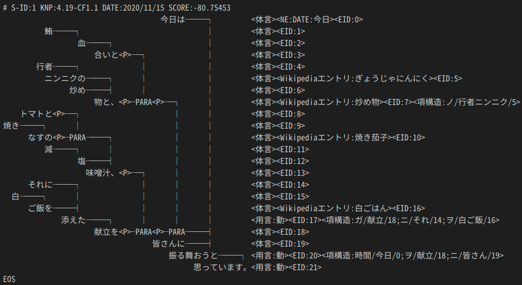
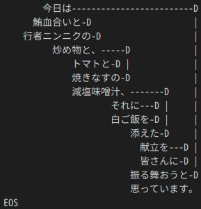

# 2020年度 自然言語解析基礎 第五回レポート

- 提出日: 2020/11/15
- 201811528 春名航亨
  - (知識情報・図書館学類3年)

## このレポートでは…

代表的な日本語文の構文解析器である[KNP](http://nlp.ist.i.kyoto-u.ac.jp/index.php?KNP)と[CaboCha](http://taku910.github.io/cabocha/)の解析結果を考察する。
入力として用いる文には、以下を用いる。
```txt
今日は鮪血合いと行者ニンニクの炒め物と、トマトと焼きなすの減塩味噌汁、それに白ご飯を添えた献立を皆さんに振る舞おうと思っています。
```

「`献立`」に「`鮪血合いと行者ニンニクの炒め物と、`/`トマトと焼きなすの減塩味噌汁、`/`それに白ご飯を添えた`」がそれぞれ係っていることを期待する。

## ①KNP

### 実行

```bash
# yusanish/jumanpp_knpを使用
$ docker run -it yusanish/jumanpp_knp:latest
$ eval {knp,juman}\ -v\;
knp 4.19
juman 7.01
$ juman << A | knp -anaphora
今日は鮪血合いと行者ニンニクの炒め物と、\
トマトと焼きなすの減塩味噌汁、\
それに白ご飯を添えた献立を皆さんに振る舞おうと思っています。
A
```



### 考察

- 「`献立`」に各料理名が並列に係っている期待した通りの構造になっている。

## ②CaboCha

### 実行

```bash
# josjos7/cabocha-dockerを使用
$ docker run -it josjos7/cabocha-docker:latest bash
$ cabocha -v
cabocha of 0.69
$ cabocha -f2 << A
今日は鮪血合いと行者ニンニクの炒め物と、\
トマトと焼きなすの減塩味噌汁、\
それに白ご飯を添えた献立を皆さんに振る舞おうと思っています。
A
```



```bash
* 0 13D 0/1 -0.227719
今日    名詞,副詞可能,*,*,*,*,今日,キョウ,キョー
は      助詞,係助詞,*,*,*,*,は,ハ,ワ
* 1 2D 1/2 0.829338
鮪      名詞,一般,*,*,*,*,鮪,マグロ,マグロ
血合い  名詞,一般,*,*,*,*,血合い,チアイ,チアイ
と      助詞,並立助詞,*,*,*,*,と,ト,ト
* 2 3D 1/2 0.938962
行者    名詞,一般,*,*,*,*,行者,ギョウジャ,ギョージャ
ニンニク        名詞,一般,*,*,*,*,ニンニク,ニンニク,ニンニク
の      助詞,連体化,*,*,*,*,の,ノ,ノ
* 3 6D 1/2 0.587822
炒め    動詞,自立,*,*,一段,連用形,炒める,イタメ,イタメ
物      名詞,接尾,一般,*,*,*,物,ブツ,ブツ
と      助詞,並立助詞,*,*,*,*,と,ト,ト
、      記号,読点,*,*,*,*,、,、,、
* 4 5D 0/1 0.502323
トマト  名詞,一般,*,*,*,*,トマト,トマト,トマト
と      助詞,並立助詞,*,*,*,*,と,ト,ト
* 5 6D 1/2 0.868580
焼き    名詞,一般,*,*,*,*,焼き,ヤキ,ヤキ
なす    名詞,一般,*,*,*,*,なす,ナス,ナス
の      助詞,連体化,*,*,*,*,の,ノ,ノ
* 6 10D 2/2 0.422005
減      名詞,一般,*,*,*,*,減,ゲン,ゲン
塩      名詞,一般,*,*,*,*,塩,シオ,シオ
味噌汁  名詞,一般,*,*,*,*,味噌汁,ミソシル,ミソシル
、      記号,読点,*,*,*,*,、,、,、
* 7 9D 0/1 0.175010
それ    名詞,代名詞,一般,*,*,*,それ,ソレ,ソレ
に      助詞,格助詞,一般,*,*,*,に,ニ,ニ
* 8 9D 1/2 1.964633
白      名詞,一般,*,*,*,*,白,シロ,シロ
ご飯    名詞,一般,*,*,*,*,ご飯,ゴハン,ゴハン
を      助詞,格助詞,一般,*,*,*,を,ヲ,ヲ
* 9 10D 0/1 1.731998
添え    動詞,自立,*,*,一段,連用形,添える,ソエ,ソエ
た      助動詞,*,*,*,特殊・タ,基本形,た,タ,タ
* 10 12D 0/1 1.746095
献立    名詞,一般,*,*,*,*,献立,コンダテ,コンダテ
を      助詞,格助詞,一般,*,*,*,を,ヲ,ヲ
* 11 12D 0/1 1.843373
皆さん  名詞,一般,*,*,*,*,皆さん,ミナサン,ミナサン
に      助詞,格助詞,一般,*,*,*,に,ニ,ニ
* 12 13D 0/2 -0.227719
振る舞お        動詞,自立,*,*,五段・ワ行促音便,未然ウ接続,振る舞う,フルマオ,フルマオ
う      助動詞,*,*,*,不変化型,基本形,う,ウ,ウ
と      助詞,格助詞,引用,*,*,*,と,ト,ト
* 13 -1D 0/3 0.000000
思っ    動詞,自立,*,*,五段・ワ行促音便,連用タ接続,思う,オモッ,オモッ
て      助詞,接続助詞,*,*,*,*,て,テ,テ
い      動詞,非自立,*,*,一段,連用形,いる,イ,イ
ます    助動詞,*,*,*,特殊・マス,基本形,ます,マス,マス
。      記号,句点,*,*,*,*,。,。,。
EOS
```

### 考察

- 「`減塩味噌汁`」に「`鮪血合いと行者ニンニクの炒め物と、`/`トマトと焼きなすの`」が係っている
- 「`献立`」に「`減塩味噌汁`」と「`それに白ご飯を添えた`」が係っている
- 「`それに`」が接続詞でなく代名詞+助詞と取られてしまっている
- mecabを使用しているためかlatticeフォーマットがmecabのそれと同じ
